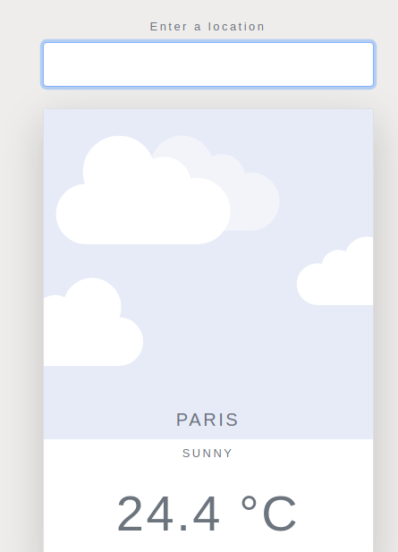

# Weather-app
 <h1 align="center">Weather--App</h1>

  

    Website designed to consult the wather forecast, you can search for a specific location and toogle displaying the data in Faherenheit or Celsius
  

## Preview:

### Built with

- HTML
- JavaScript
- CSS

## Setup and run the app

> Follow these steps to set up and run the quickstart:
  - Clone/Download this repo and open this folder in a Terminal.
    `git clone git@github.com:atenaiis/Weather-app.git`
  - Install the Nodejs:
  [https://nodejs.org/en/download/](https://nodejs.org/en/download/)

  - Run npm install on your terminal *be sure that you are in the project's directory*:
  `npm intall`
  - Finally run a local server using chrome:
  `npm run start`
  -Go http://localhost:8080/

### Live Demo :

[Click here](https://atenaiis.github.io/WeatherApp/)

### Author

👤 **Atenais Campos**

- Github: [@atenaiis](https://github.com/atenaiis)
- Twitter: [@spranomarian](https://twitter.com/SopranoMarian)
- Linkedin: [linkedin](https://www.linkedin.com/in/mariana-atenai-campos-garcia-a30791143/)

## 🤝 Contributing

Contributions, issues and feature requests are welcome!

Feel free to check the [issues page](https://github.com/atenaiis/Weather-app/issues).

## Show your support

Give a ⭐️ if you like this project!